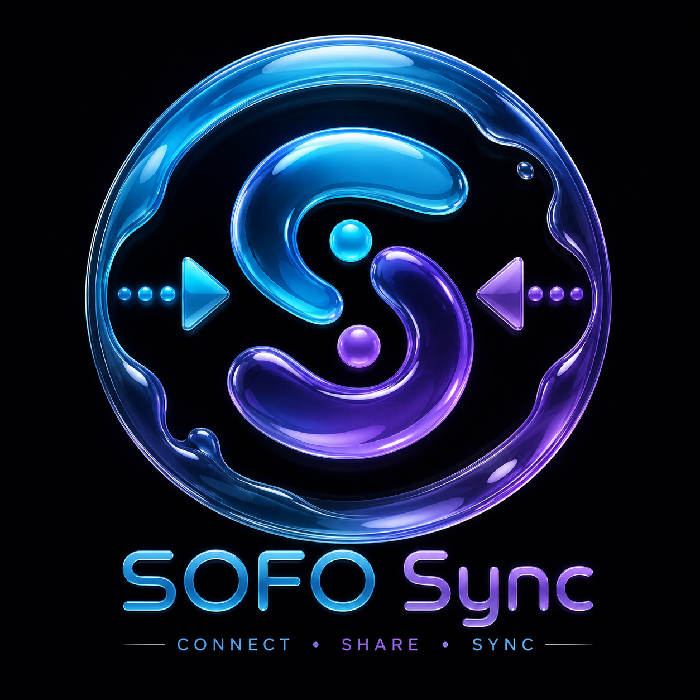

<div align="center">

  

  # SOFO Sync ⚡
  ### **One QR. Instant Connection. Real-Time Cross-Device Collaboration.**

  [](https://sofo-syc.netlify.app)
  [](https://sofo-syc.onrender.com/api)
  [](https://nextjs.org)
  [](https://react.dev)
  [](https://deepmind.google/technologies/gemini/)
  [](LICENSE)

</div>

---

## 🌐 Live Deployments & Repository

| Service | Environment | Live URL | Status |
|---|---|---|---|
| **Frontend Web App** | Netlify | [https://sofo-syc.netlify.app](https://sofo-syc.netlify.app) | 🟢 Live |
| **Backend API Gateway** | Render.com | [https://sofo-syc.onrender.com/api](https://sofo-syc.onrender.com/api) | 🟢 Live |
| **GitHub Repository** | GitHub | [https://github.com/mrCoderPj04/Sofo_SyC.git](https://github.com/mrCoderPj04/Sofo_SyC.git) | 🟢 Active |

---

## 🌟 Overview

**SOFO Sync** empowers cross-device collaboration in seconds without sign-up friction. Scan **One QR Code** using any mobile phone camera or enter a **6-Digit PIN** / **Shareable Link** to instantly pair mobile, tablet, desktop, and web browsers into an encrypted real-time workspace.

---

## ✨ Features

- 📱 **1-Tap Camera QR & PIN Pairing**: Point any iPhone or Android camera at the QR code to auto-pair instantly via direct URL link (`https://sofo-syc.netlify.app/?room=SOFO-XXXXXX&pin=XXXXXX`).
- 🎨 **Real-Time Cross-Device Whiteboard**: Touch-optimized for mobile devices (`onTouchStart`, `onTouchMove`, `onTouchEnd`) and mouse-optimized for desktop. Canvas strokes sync live across all connected devices.
- 📩 **Collaborative Document Cards**: Write notes and post document cards in real-time. Cards sync immediately across all connected browsers.
- 📥 **Shared File Vault**: Upload files and images with multi-device downloadable file cards.
- 🤖 **Google Gemini 2.0 Flash AI Copilot**: Ask questions about document notes, whiteboard canvas, or project tasks directly within your active session.
- 🛡️ **AES-256 Security & Subnet Verification**: Includes PIN rate-limiting (max 5 attempts), 10-minute PIN expiry, signed security tokens, and IP subnet verification.
- 🔄 **Synchronized Disconnect**: Disconnecting from any device instantly resets all connected peer devices back to the clean home screen.

---

## 📂 Repository Structure

```
SOFO-Sync/
│
├── apps/
│   ├── web/               # Next.js 15 Web Workspace & Collaboration Dashboard
│   ├── mobile/            # React Native Mobile Companion
│   └── desktop/           # Electron / Tauri Native Desktop App
│
├── backend/
│   ├── api/               # Express / HTTP REST API Gateway Service (Render)
│   ├── ai/                # Google Gemini 2.0 Flash AI Integration Engine
│   └── websocket/         # Peer Signaling Relay
│
├── render.yaml            # Render 1-Click Deployment Blueprint
├── netlify.toml           # Netlify Monorepo Deployment Config
├── shared/                # Shared Types, Constants & QR Handshake Helpers
└── README.md              # Documentation
```

---

## 🚀 Local Quick Start

### Prerequisites
- **Node.js**: `v18.x` or `v20.x`
- **npm**: `v9.x` or later

### Installation

```bash
# Clone the repository
git clone https://github.com/mrCoderPj04/Sofo_SyC.git SOFO-Sync
cd SOFO-Sync

# Install workspace dependencies
npm install

# Start Backend API Gateway (Port 5000)
PORT=5000 node backend/api/index.js

# In another terminal, start Web Application (Port 3000)
cd apps/web
npx next dev -H 0.0.0.0
```

Open **http://localhost:3000** in your browser.

---

Developed with ❤️ by **MrCoder**.
